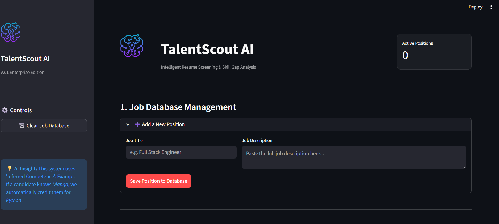
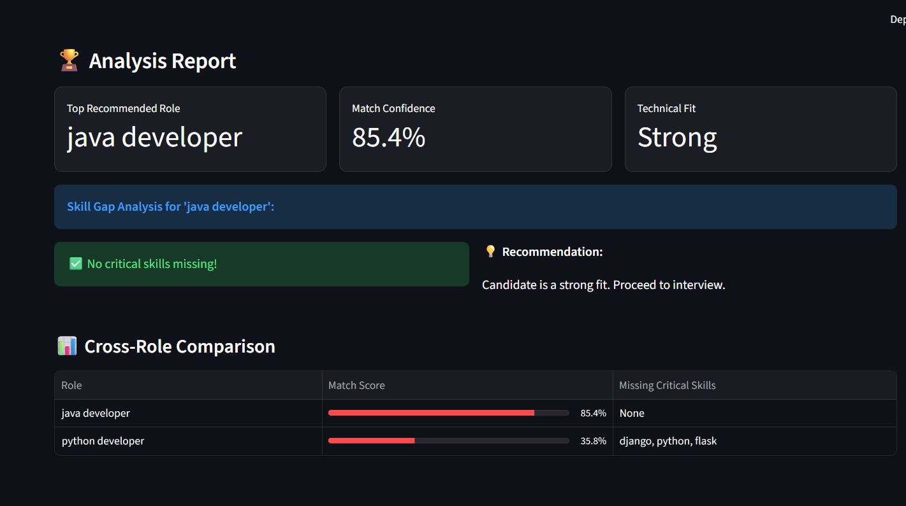

# 🧠 TalentScout AI
### Smart Resume Screening Platform (AI/ML)


---

## 🚀 Overview

**TalentScout AI** is an AI-powered resume screening platform that analyzes resumes and maps candidate skills to job requirements using **semantic understanding and skill inference**, instead of traditional keyword matching.

Conventional ATS systems often reject capable candidates simply because exact keywords are missing. TalentScout AI solves this by understanding **meaning, context, and implied skills**, making recruitment fairer and more intelligent.

> *“An ATS that thinks like a human recruiter.”*

---

## 📸 Screenshots

| **Job Database & Dashboard** | **Smart Resume Analysis** |
|:---:|:---:|
|  |  |
| *Manage open roles and track applicants* | *See semantic scores and missing skills* |

---

## ✨ Key Features

- 📄 **Universal Input:** Resume upload support (**PDF, DOCX, TXT**)
- 🧠 **Semantic Analysis:** Contextual understanding using transformer embeddings.
- 🛠️ **Smart Skill Inference:** Automatically credits implied skills.
  - *Example:* Resume says "Django" → System infers "Python".
- 📊 **Hybrid Match Scoring:** 60% Semantic Context + 40% Hard Skill Match.
- 🔍 **Gap Analysis:** Clearly lists missing skills with improvement suggestions.
- 🏆 **Auto-Ranking:** Recommends the best job role across multiple openings.
- 🖥️ **Professional UI:** Clean, intuitive interface built with Streamlit.

---

## 🧠 How It Works

### 1️⃣ Input
- HR adds one or more **Job Descriptions** to the database.
- Candidate uploads a **Resume** (PDF/DOCX).

### 2️⃣ Semantic Understanding
- Both texts are converted into vector embeddings using a **Sentence Transformer (MiniLM)**.
- **Cosine Similarity** measures the contextual alignment between the resume and the job description.

### 3️⃣ Smart Skill Mapping
- Skills are extracted using:
  - **Keyword detection** (Regex/NLP)
  - **Inference logic** (Framework → Core Skill mapping)
- The system identifies matching skills and critical missing skills.

### 4️⃣ Scoring Logic
The final match percentage is calculated using a weighted formula:

> **Final Score = (Semantic Similarity × 0.6) + (Skill Match Score × 0.4)**

### 5️⃣ Output
- Match percentage
- Recommended job role
- Missing skills list
- Comparison table across all open roles

---

## 📊 Why TalentScout AI?

| Feature | ❌ Traditional ATS | ✅ TalentScout AI |
|------|-----------------|----------------|
| **Matching Method** | Keyword-based | **Semantic (Meaning-based)** |
| **Skill Inference** | ❌ No | **✅ Yes (Infers Context)** |
| **Missing Keywords** | Auto-reject | **Context-aware analysis** |
| **Transparency** | Black-box | **Clear gap analysis** |
| **Role Comparison** | Manual | **Automatic ranking** |

---

## 🛠️ Tech Stack

- **Language:** Python
- **AI/ML:** Sentence Transformers (`all-MiniLM-L6-v2`)
- **NLP:** Cosine Similarity, Regex
- **File Handling:** PyPDF2, python-docx
- **Frontend/UI:** Streamlit
- **Data Handling:** Pandas

---

## ▶️ How to Run Locally

1. **Clone the Repository**
   ```bash
   git clone [https://github.com/Vani691/TalentScout-AI.git](https://github.com/Vani691/TalentScout-AI.git)
   cd TalentScout-AI
   Create Virtual Environment

Bash
python -m venv venv

# Windows:
venv\Scripts\activate

# Mac/Linux:
source venv/bin/activate
Install Dependencies

Bash
pip install streamlit sentence-transformers torch PyPDF2 python-docx pandas
Run the App

Bash
streamlit run app.py
🎯 Target Users
HR Teams: To automate initial screening.

Recruiters: To find "hidden gems" rejected by keyword filters.

Hiring Managers: To quickly rank candidates.

Placement Cells: To help students optimize resumes.

👥 Team – Code Alchemists
Project built for Multiverse of Tech Hackathon 2026 at Smt. Indira Gandhi College of Engineering.

Shravani Mane (Team Lead)

Shubham

Sanika

Sunaina

📌 Hackathon Note
This project was developed during the official hackathon window as a working MVP. Open-source AI models were used, while all application logic, scoring strategy, UI flow, and skill inference mechanisms were implemented by the team.
